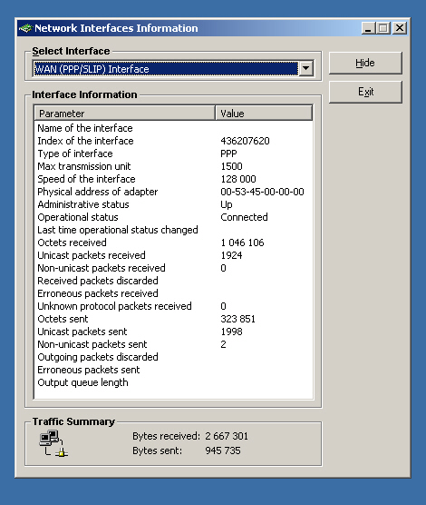



## Connection info retriever\.\.\.

### Description

With this code you can retrieve information about your connection(LAN,PPP,etc) like connection speed,MTU,Bytes sent/receive and many more.

ATTN:This code is NOT mine so please DO NOT vote for me.It was given to me as an answer to a question of mine in a forum and I thought it'd be very usefull to people.Enjoy
 
### More Info
 
Misc

             |
---                |---
**Submitted On**   |2001-01-24 13:58:06
**By**             |[John Kokkinakis](https://github.com/Planet-Source-Code/PSCIndex/blob/master/ByAuthor/john-kokkinakis.md)
**Level**          |Advanced
**User Rating**    |5.0 (15 globes from 3 users)
**Compatibility**  |VB 6\.0
**Category**       |[Miscellaneous](https://github.com/Planet-Source-Code/PSCIndex/blob/master/ByCategory/miscellaneous__1-1.md)
**World**          |[Visual Basic](https://github.com/Planet-Source-Code/PSCIndex/blob/master/ByWorld/visual-basic.md)
**Archive File**   |[CODE\_UPLOAD171033152001\.zip](https://github.com/Planet-Source-Code/john-kokkinakis-connection-info-retriever__1-21664/archive/master.zip)

